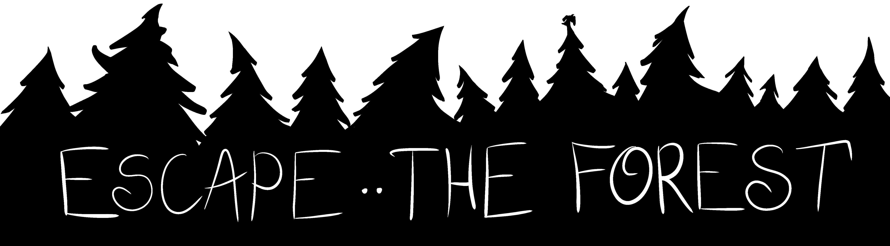
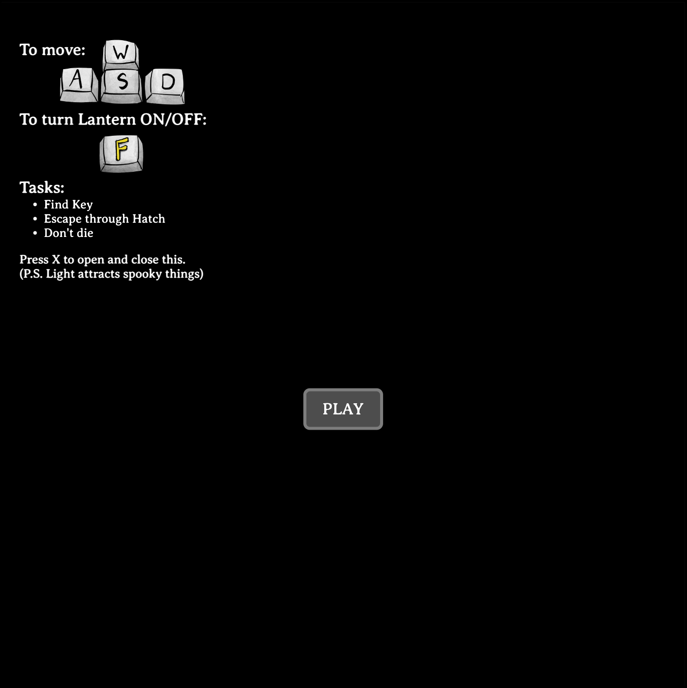
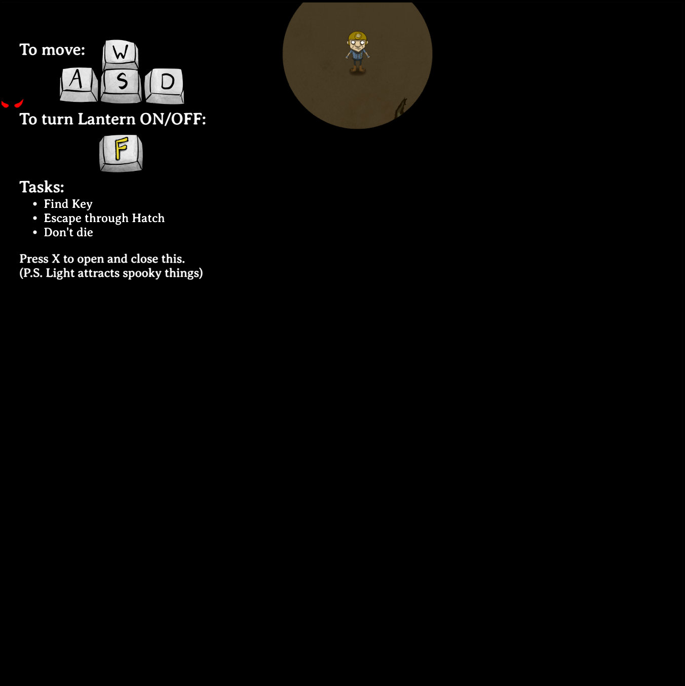
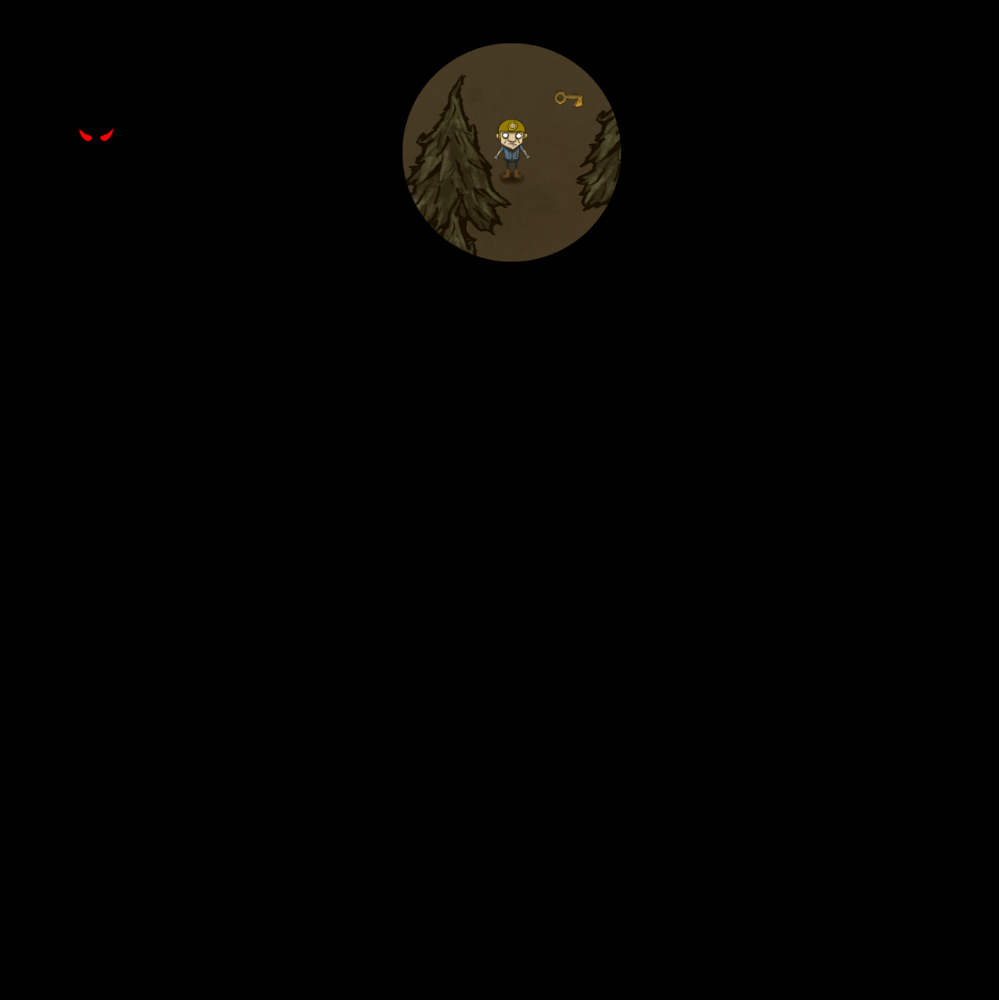
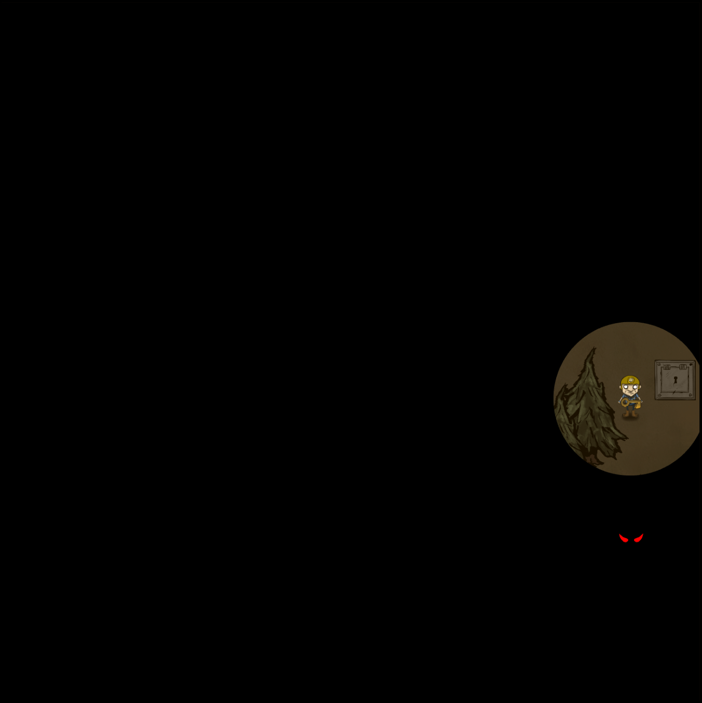
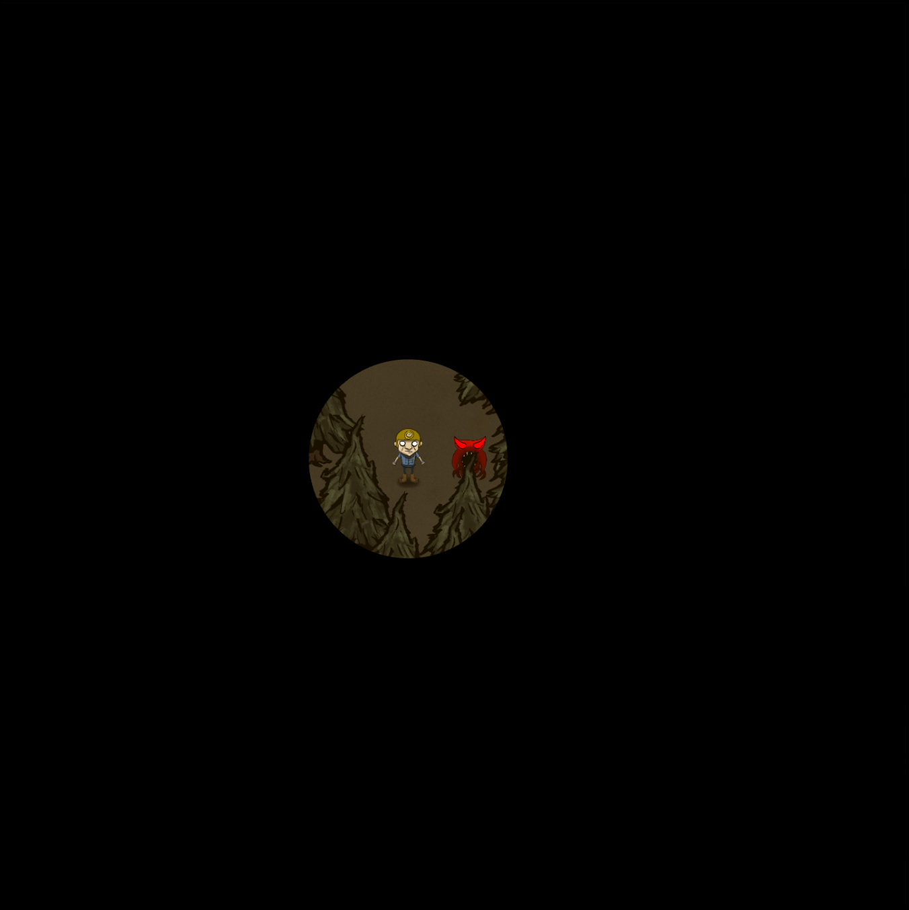
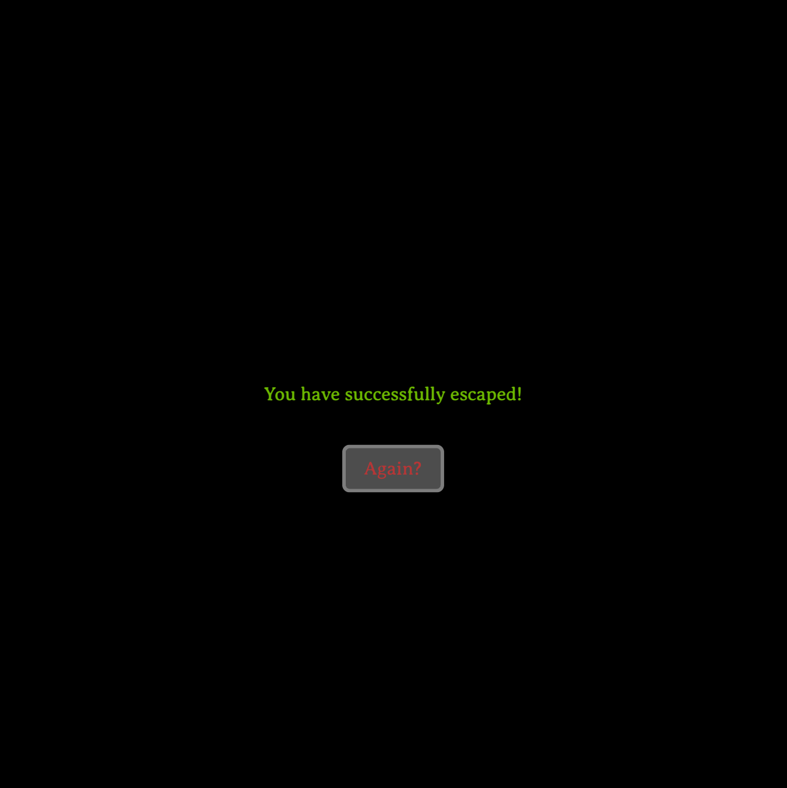
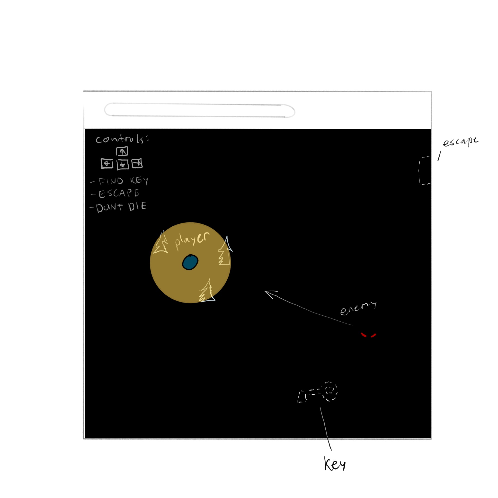

#

Take the role of a hapless adventurer lost in the shadowy woods. Explore your dark surroundings to find a way to escape these woods while avoiding the danger lurking in the dark.

Play it here: https://ownerl.github.io/Escape-The-Forest/

## About
Escape The Forest is a top down 2D exploration and escape game made using vanilla Javascript. The playable area (refered to as map) is a square area enshrouded in shadows. The player must explore the map to find a key that can open an escape hatch somewhere on the map. The map is also filled with trees that cumulatively slow down the player. The trees, hatch, and key are all randomly generated so each playthrough is slightly different. 

The player also has access to a lantern that can light up their surroundings in a short radius. However, after a certain grace period, an enemy will spawn outside the map and chase after the player if they are lit up. The player can choose to turn off their lantern at which point the enemy will merely approach the player's last known location.

The game features sound effects for the player's movements, picking up a key, escaping, and when the enemy spawns as well as ambient forest noises for immersion.

## How To Play
Use WASD to control the player's movements. Use F to turn the lantern ON and OFF. Collect the key by walking over it and escape by approaching the hatch with the key in your possession. 
If the enemy, recognizable by evil looking eyes and mean design, touches you, you will die and receive the bad ending. Escaping with the key will earn you a good ending. By ending I mean either a nice text or a bad text. :D

## Screenshots

## Tech Used
- HTML/CSS/Canvas
- Javascript
- Procreate
- OpenToonz
- Audacity

## Credits
Credit to Freesound.org for sound effects used in the game, as well as Magic of Sounds on YouTube for the ambient forest noises at night.

Special thanks to Franks Laboratory on YouTube. His class based approach to modular game development helped me keep my code organized and optimized for future improvements and expansions. For example, adding new enemy types, keys, or winning conditions is fairly straightforward (if slightly tedious).

Big thanks to Tom Kolsrud for assisting me in fixing some buggy HTML elements and ChatGPT for helping explain to me certain concepts and why they did or did not work.

Additional thanks to Leah Livingston and Kylie Facison for playtesting my game for balance tweaks and changes.

# Project Planning & Initial Mockup

## About
Escape The Forest will be a top down 2D exploration game where the playable area (henceforth refered to as a map), a spooky forest, is enshrouded in shadows, thus limiting the player's vision. The player shall start at a spot on the map with a lantern where they will be given a short grace period to explore their immediate surroundings. 

After the grace period, an enemy will spawn somewhere on the map (a set minimum distance from player) and slowly stalk the player with a lit lantern with only their glowing red eye visible in the darkness. The player will have the ability to turn off their lantern which will cause the enemy to approach the player's last known location; the tradeoff is that the player will not be able to see their surroundings while moving and may encounter nautral hazards or barriers. The player wins by escaping from a designated spot, or loses by dying to the enemy.

## Tech Required
- HTML/CSS/Canvas
- Javascript
- Procreate

## Wireframe

## MVP Goals
- Complete map
- Render lantern lighting effect
- Functional player with movement
- Functinal enemy that chases player and is affected by lighting
- Enemy based lose condition 
- Win condition for escaping
- "Key" or "Object" required to find to unlock escape
- Render end game
- Render control scheme and player task (tutorial/help message)

## Stretch Goals
- Additional enemy behaviour (search a radius of the player's last known location)
- Natural hazards like pits or traps the player may run into (and die)
- Multiple objects or keys to collect (some optional)
- Mini-puzzles or tasks to unlock objects/keys
- Map randomization - player/enemy spawn, object/key placement, escape placement, hazard placement
- Music and sound effects
- More detailed art

## Potential Roadblocks
- Learning new canvas technologies
- Layering canvas elements
